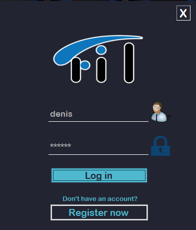
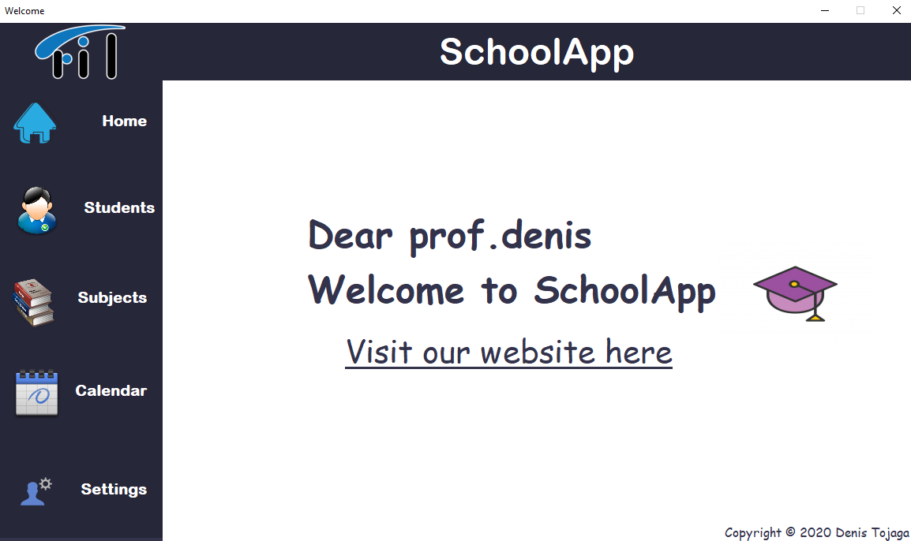
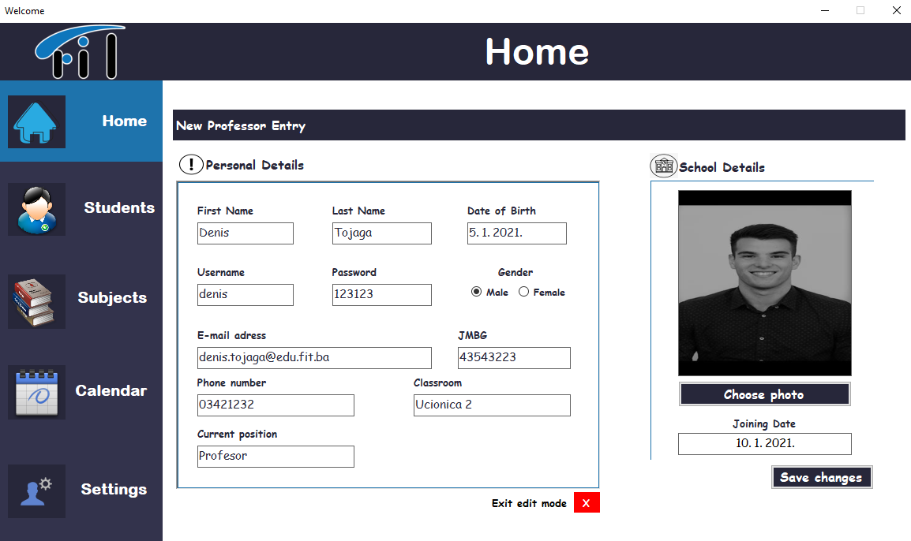
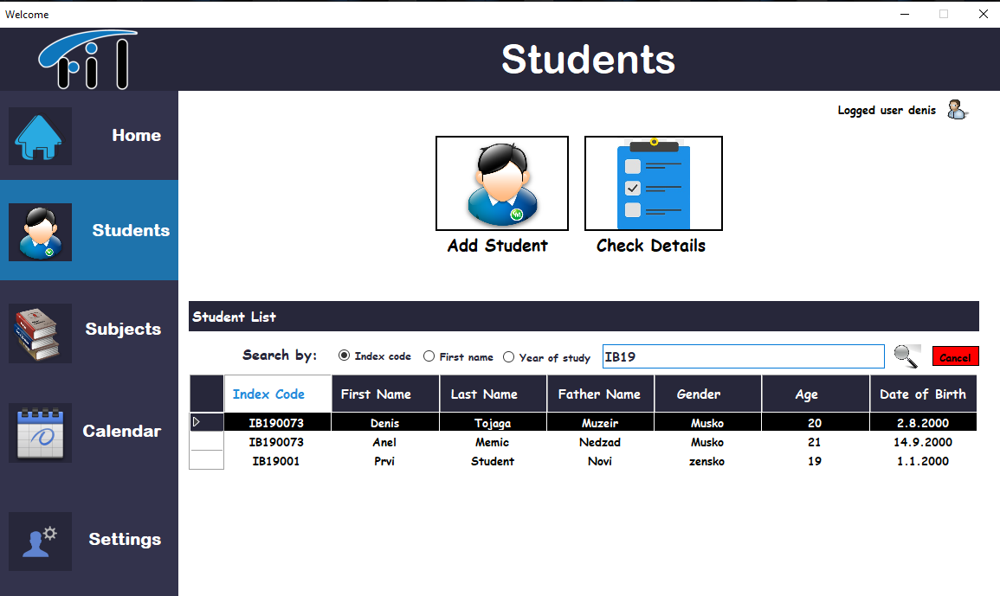
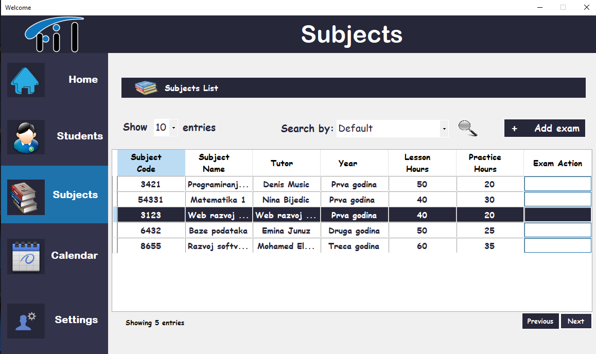
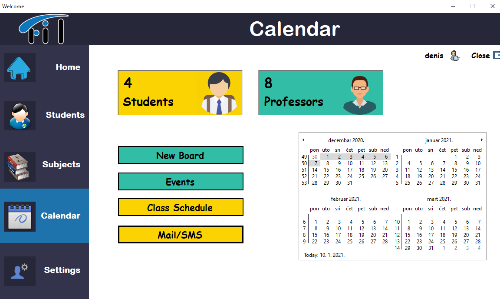
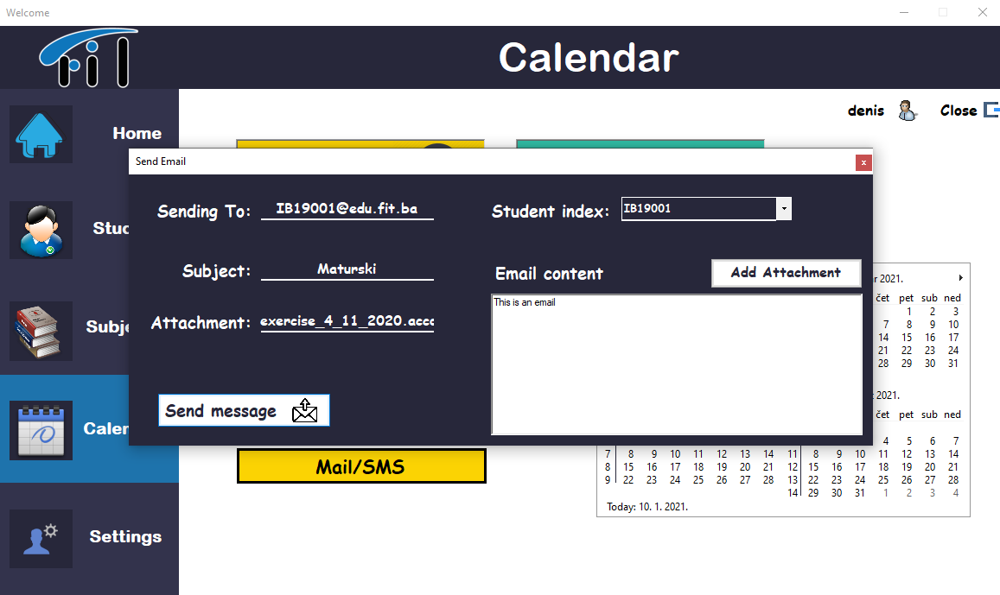
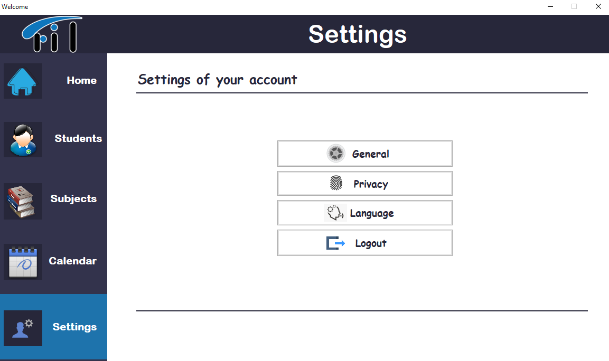
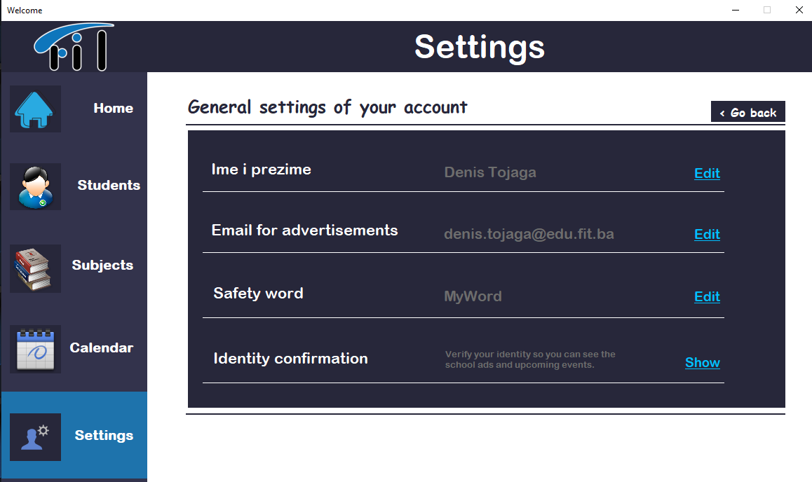

# SchoolApplication
 

School Management System - Demo Version

### Login and Registration
Main functionality where user can login with their credentials.If you are not registered,you do that with Registration form.
  

  

  
Main form consists of several child ones in which you can go from one to another.HOME,SETTINGS,SUBJECTS,CALENDAR,STUDENTS lets you to replicate behaving of a professor.
  

  

### HOME
This form lets user to edit his details and save them for next time in SQLite database
  

  

### STUDENTS
Form lets user to have a view of all students logged on management system and also can see their details, professor also can add new student through new form,
professor can search students with Index code, First Name of Year of study ( depends on his needs) 
  

  

### SUBJECTS 
Form lets user to have a view of all subjects in school and their details, you can also search for subjects with year of study and decide how much fields you want
to show in the result
Adding an exam is also implemented where you can add new subject and its actions through out new form
  

  

### CALENDAR 
Only lets you to see the implemented calendar and send mail to specific student from base in a new form (you can add attachment in mail)
  

  
  

  

### SETTINGS 
Form has several moods where you can set some general setttings (ex. Safe word,Email verification,Email),language settings where user can decide which language wants
and logout setting where you go back to the starting form
User can go back and forward between these mods
  

  

  

  

